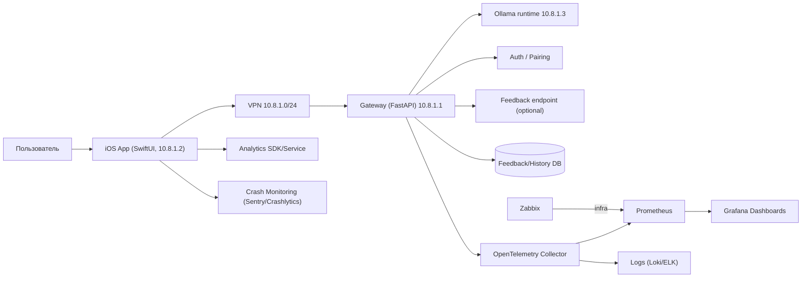
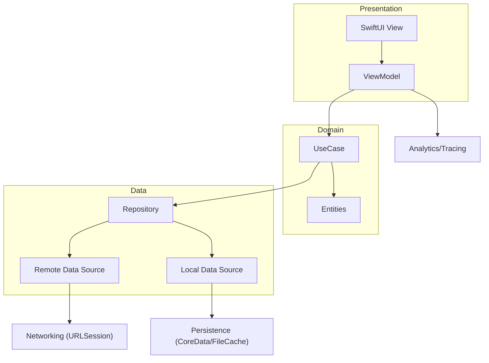
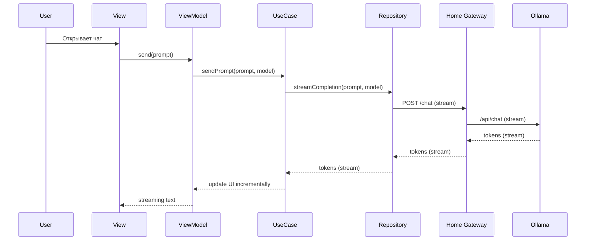
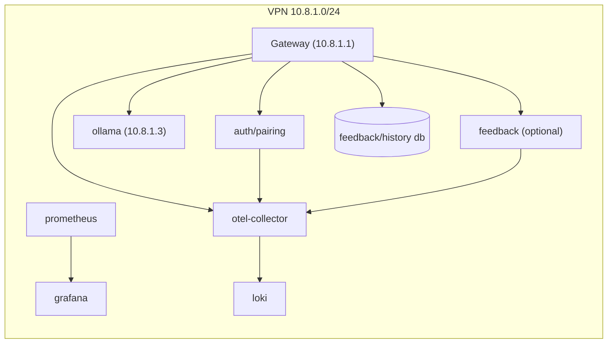

# Архитектура системы

Цель: описать top‑level архитектуру и сетевую связность сервисов/микросервисов (требование «2 балла» из QAP) для кейса «все устройства находятся в одной VPN (10.8.1.0/24): iOS (10.8.1.2) → gateway (10.8.1.1) → Ollama (10.8.1.3)», а также внутреннюю архитектуру iOS‑клиента на базе `src/app/mad_application`. Практическая реализация gateway расположена в `src/home_gateway` (FastAPI + Docker).

## 1. Контекст (C4: System Context)

Примечания:

- Все узлы общаются напрямую внутри VPN 10.8.1.0/24 — нет публичного VPS/прокси.
- Gateway (10.8.1.1) и Ollama (10.8.1.3) не доступны извне без подключения к VPN.
- Эндпоинт Ollama на `http://10.8.1.3:11434/` отвечает «Ollama is running», что подтверждает доступность сервиса из VPN.
- Для учебного проекта допускается замена `Analytics/Crash` на SaaS‑решение; важно, чтобы выбранный инструмент и метрики были явно зафиксированы.
- База данных может использоваться для хранения feedback и истории запросов; если не разворачивается, компонент отмечается как optional.

## 2. Контейнеры (C4: Containers) и протоколы

- iOS App → Gateway (10.8.1.1): HTTPS/HTTP внутри VPN; поддержка streaming (SSE/WebSocket) при необходимости.
- Gateway → Ollama (10.8.1.3): HTTP внутри VPN.
- Gateway → DB: TCP (PostgreSQL/SQLite), только внутри VPN.
- Home Gateway → Observability: OTLP (gRPC/HTTP) в OpenTelemetry Collector.
- Prometheus → Home Gateway: pull‑scrape `/metrics` (или через collector).

## 3. Внутренняя архитектура iOS‑клиента (слои)

Рекомендованный вариант для SwiftUI: Clean Architecture + MVVM.

Ключевые принципы:

- UI не знает про сеть/хранилище.
- Domain изолирован от фреймворков.
- Data инкапсулирует кэш и сетевую стратегию.

## 4. Основные потоки данных (пример)

### 4.1. Отправка промпта и streaming ответа (UC‑04)

### 4.2. Ошибка сети / stop generation (degradation)

- При `timeout`/`no connection`: показать понятную причину (VPN/домашний ПК недоступен) + Retry.
- При `401/403`: инициировать перепривязку/pairing (без циклических ретраев).
- При `429`: показать подсказку о лимитах; увеличить backoff.
- Stop generation: клиент отменяет стрим; gateway пробрасывает cancel/close upstream.

## 5. Развертывание (вариант для «2 балла»)

Вариант с контейнерами/службами в одной VPN:

Даже если фактически часть компонентов не разворачивается, эта схема демонстрирует понимание сетевой топологии и observability.
