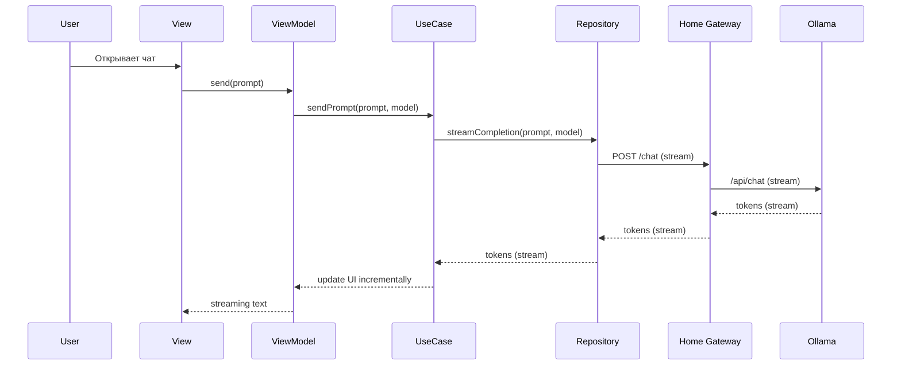

# Архитектура системы

Цель: описать top‑level архитектуру и сетевую связность сервисов/микросервисов (требование «2 балла» из QAP) для кейса «мобильный клиент → домашний ПК с Ollama через VPS + AmneziaWG», а также внутреннюю архитектуру iOS‑клиента на базе `src/app/mad_application`.

## 1. Контекст (C4: System Context)

```mermaid
flowchart LR
  User[Пользователь] --> iOS[iOS App (SwiftUI)]
  iOS --> VPS[VPS (public IP)]
  VPS --> Edge[Edge Reverse Proxy\n(Caddy/Nginx)]
  VPS --> AWG[AmneziaWG Server\n(WireGuard)]
  Home[Домашний ПК] --> AWG
  Edge --> GW[Home Gateway / BFF\n(через WG tunnel)]
  GW --> Ollama[Ollama (LLM runtime)]
  GW --> Auth[Auth / Pairing]
  GW --> Feedback[Feedback endpoint (optional)]
  iOS --> Analytics[Analytics SDK/Service]
  iOS --> Crash[Crash Monitoring (Sentry/Crashlytics)]
  GW --> OTel[OpenTelemetry Collector]
  OTel --> Prom[Prometheus]
  Prom --> Grafana[Grafana Dashboards]
  OTel --> Logs[Logs (Loki/ELK)]
  Zabbix[Zabbix] -.infra-> Prom
```

Примечания:

- Ollama и домашний gateway не открываются в интернет: наружу публикуется только VPS (TLS), а до дома трафик идет через WireGuard (AmneziaWG).
- Edge reverse proxy на VPS завершает TLS и проксирует трафик к домашнему gateway по WG‑интерфейсу.
- Для учебного проекта допускается замена `Analytics/Crash` на SaaS‑решение; важно, чтобы выбранный инструмент и метрики были явно зафиксированы.

## 2. Контейнеры (C4: Containers) и протоколы

- iOS App → VPS Edge: HTTPS + TLS; streaming (SSE/WebSocket) при необходимости.
- VPS Edge → Home Gateway: HTTP(S) поверх WireGuard tunnel (WG интерфейс); доступ ограничен firewall'ом.
- Home Gateway → Ollama: HTTP (loopback/локальная сеть на домашнем ПК).
- Home Gateway → Observability: OTLP (gRPC/HTTP) в OpenTelemetry Collector.
- Prometheus → Home Gateway: pull‑scrape `/metrics` (или через collector).

## 3. Внутренняя архитектура iOS‑клиента (слои)

Рекомендованный вариант для SwiftUI: Clean Architecture + MVVM.

```mermaid
flowchart TB
  subgraph Presentation[Presentation]
    View[SwiftUI View] --> VM[ViewModel]
  end

  subgraph Domain[Domain]
    UC[UseCase] --> Ent[Entities]
  end

  subgraph Data[Data]
    Repo[Repository] --> Remote[Remote Data Source]
    Repo --> Local[Local Data Source]
  end

  VM --> UC
  UC --> Repo
  Remote --> Net[Networking (URLSession)]
  Local --> Store[Persistence (CoreData/FileCache)]
  VM --> Telemetry[Analytics/Tracing]
```

Ключевые принципы:

- UI не знает про сеть/хранилище.
- Domain изолирован от фреймворков.
- Data инкапсулирует кэш и сетевую стратегию.

## 4. Основные потоки данных (пример)

### 4.1. Отправка промпта и streaming ответа (UC‑04)



### 4.2. Ошибка сети / stop generation (degradation)

- При `timeout`/`no connection`: показать понятную причину (VPN/домашний ПК недоступен) + Retry.
- При `401/403`: инициировать перепривязку/pairing (без циклических ретраев).
- При `429`: показать подсказку о лимитах; увеличить backoff.
- Stop generation: клиент отменяет стрим; gateway пробрасывает cancel/close upstream.

## 5. Развертывание (вариант для «2 балла»)

Вариант с контейнерами на домашнем ПК (учебный стенд), показывающий сетевую связность:

```mermaid
flowchart LR
  subgraph VPS[VPS (Docker)]
    Edge[edge-proxy (caddy/nginx)]
    AWG[amnezia-wg (server)]
    OTelV[otel-collector (optional)]
    Prom[prometheus]
    Graf[grafana]
    Loki[loki]
  end

  subgraph Home[Home PC]
    BFF[home-gateway]
    Auth[auth/pairing]
    Ollama[ollama]
    FB[feedback (optional)]
  end

  BFF --> Auth
  BFF --> Ollama
  BFF --> FB
  BFF --> OTelV
  Auth --> OTelV
  FB --> OTelV
  Edge --> BFF
  AWG --- BFF
  Prom --> Graf
  OTelV --> Loki
```

Даже если фактически часть компонентов не разворачивается, эта схема демонстрирует понимание сетевой топологии и observability.
