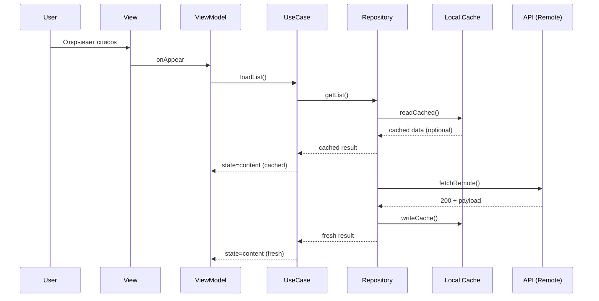
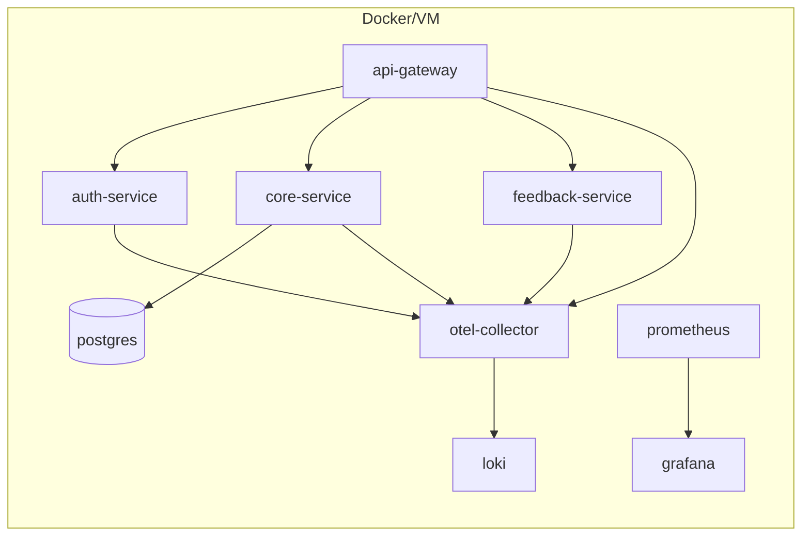

# Архитектура системы

Цель: описать top‑level архитектуру и сетевую связность сервисов/микросервисов (требование «2 балла» из QAP), а также внутреннюю архитектуру iOS‑клиента на базе `src/app/mad_application`.

## 1. Контекст (C4: System Context)

```mermaid
flowchart LR
  User[Пользователь] --> iOS[iOS App (SwiftUI)]
  iOS --> API[Backend API Gateway / BFF]
  API --> Auth[Auth Service]
  API --> Core[Core Service (Домен X)]
  Core --> DB[(DB)]
  API --> Feedback[Feedback Service]
  iOS --> Analytics[Analytics SDK/Service]
  iOS --> Crash[Crash Monitoring (Sentry/Crashlytics)]
  API --> OTel[OpenTelemetry Collector]
  OTel --> Prom[Prometheus]
  Prom --> Grafana[Grafana Dashboards]
  OTel --> Logs[Logs (Loki/ELK)]
  Zabbix[Zabbix] -.infra-> Prom
```

Примечания:

- Если backend реализован как монолит, блоки `Auth/Core/Feedback` могут быть модулями внутри одного сервиса, но на диаграмме они сохранены как логические контейнеры (для демонстрации связности).
- Для учебного проекта допускается замена `Analytics/Crash` на SaaS‑решение; важно, чтобы выбранный инструмент и метрики были явно зафиксированы.

## 2. Контейнеры (C4: Containers) и протоколы

- iOS App → API: HTTPS (JSON), TLS, таймауты/ретраи.
- API → Auth/Core/Feedback: HTTP/gRPC внутри сети (по выбору), mTLS при необходимости.
- Core → DB: SQL.
- Backend → Observability: OTLP (gRPC/HTTP) в OpenTelemetry Collector.
- Prometheus → Backend: pull‑scrape `/metrics` (или через collector).

## 3. Внутренняя архитектура iOS‑клиента (слои)

Рекомендованный вариант для SwiftUI: Clean Architecture + MVVM.

```mermaid
flowchart TB
  subgraph Presentation[Presentation]
    View[SwiftUI View] --> VM[ViewModel]
  end

  subgraph Domain[Domain]
    UC[UseCase] --> Ent[Entities]
  end

  subgraph Data[Data]
    Repo[Repository] --> Remote[Remote Data Source]
    Repo --> Local[Local Data Source]
  end

  VM --> UC
  UC --> Repo
  Remote --> Net[Networking (URLSession)]
  Local --> Store[Persistence (CoreData/FileCache)]
  VM --> Telemetry[Analytics/Tracing]
```

Ключевые принципы:

- UI не знает про сеть/хранилище.
- Domain изолирован от фреймворков.
- Data инкапсулирует кэш и сетевую стратегию.

## 4. Основные потоки данных (пример)

### 4.1. Загрузка списка (UC‑03)



### 4.2. Ошибка сети (degradation)

- При `timeout`/`no connection`: показывать кэш (если есть) + non-blocking баннер «Нет сети».
- При `401`: перевести в flow re-auth (без циклических ретраев).
- При `5xx`: предложить Retry + отправить событие ошибки в telemetry (без PII).

## 5. Развертывание (вариант для «2 балла»)

Вариант с контейнерами (учебный стенд):



Даже если фактически часть компонентов не разворачивается, эта схема демонстрирует понимание сетевой топологии и observability.

