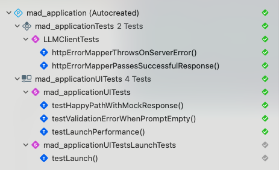
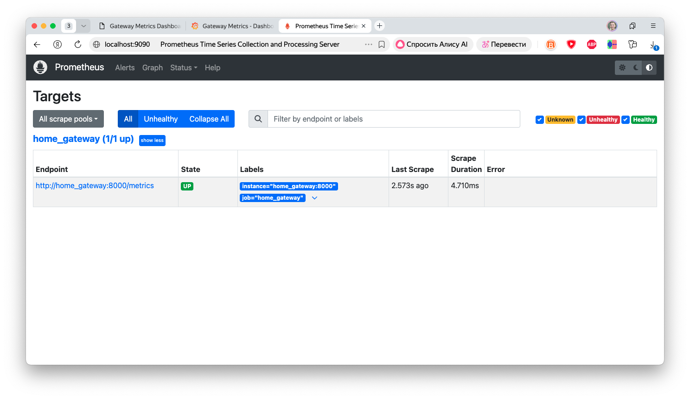
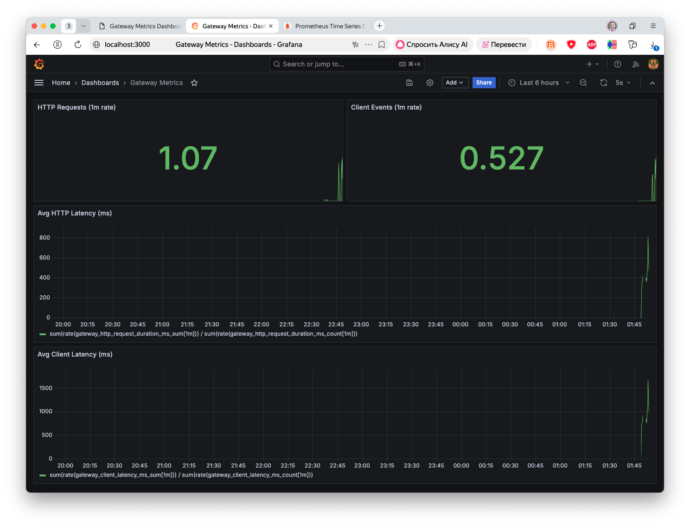
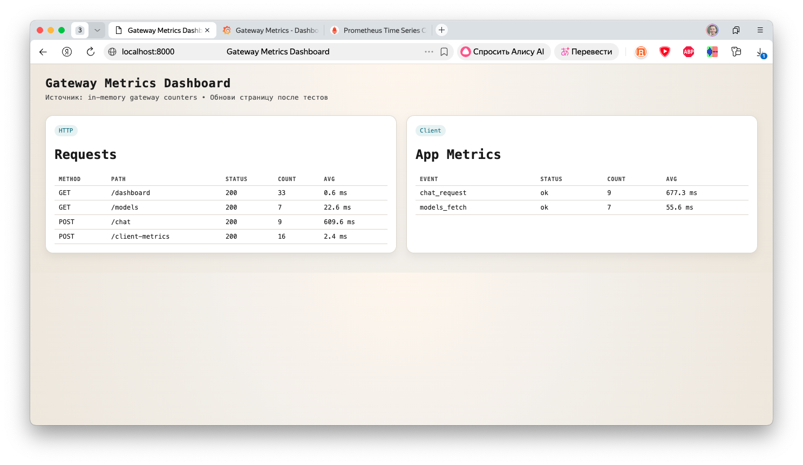
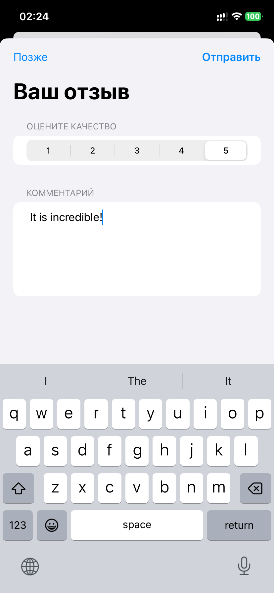

# Отчет по текущей реализации (QAP)

Этот файл фиксирует, что именно реализовано в коде, и где это посмотреть.

## 1. Архитектура и связность

- iOS клиент → Gateway → Ollama через VPN.
- Метрики и feedback проходят через gateway.
- Подтверждение: диаграммы и скриншоты в `src/docs/architecture.md` и `src/docs/images/dashboard/`.

## 2. Тестирование (Run structured testing)

- UI automation: `src/app/mad_application/mad_applicationUITests/mad_applicationUITests.swift`.
- Performance: `XCTApplicationLaunchMetric()` и `XCTClockMetric()` в UI тестах.
- Скриншот: `src/docs/images/autotests/complete_all_tests.png`.
- Видео на устройстве: `src/docs/images/autotests/device_test.MP4`.

## 3. Метрики (Measure quantitative metrics)

### 3.1. Клиент

- События: `tap_*`, `connection_state`, `model_selected`, `session_duration`.
- Метрики запросов: `models_fetch`, `chat_request`.
- Код: `src/app/mad_application/mad_application/MetricsReporter.swift`, `src/app/mad_application/mad_application/ChatViewModel.swift`, `src/app/mad_application/mad_application/ContentView.swift`.

### 3.2. Gateway

- Endpoints: `/metrics`, `/dashboard`, `/client-metrics`.
- Prometheus scrape: `src/prometheus.yml`.
- Grafana provisioning: `src/grafana/provisioning/`.
- Скриншоты: `src/docs/images/dashboard/Prometheus.png`, `src/docs/images/dashboard/Grafana.png`, `src/docs/images/dashboard/Metrics.png`.

## 4. Feedback (Collect user feedback)

- Prompt показывается после ответа на промпт с задержкой 10 секунд.
- Оценка 1–5 + комментарий.
- Клиент: `src/app/mad_application/mad_application/ContentView.swift`, `src/app/mad_application/mad_application/FeedbackReporter.swift`.
- Gateway: `POST /feedback`, `GET /feedback/summary`, метрики `gateway_feedback_*`.
- Скриншоты: `src/docs/images/feedback/user_satisfaction.png`, `src/docs/images/feedback/device_satisfaction.PNG`.

## 5. Запуск на устройстве (Productivity)

- Приложение запускается на реальном устройстве (демо‑видео).
- Артефакт: `src/docs/images/productivity/usecase.MP4`.
